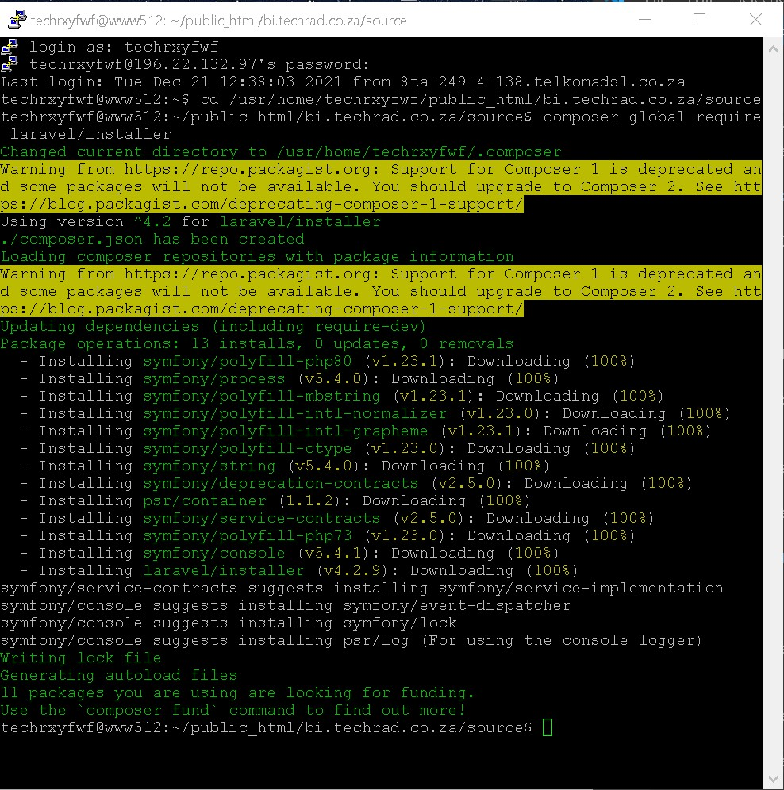
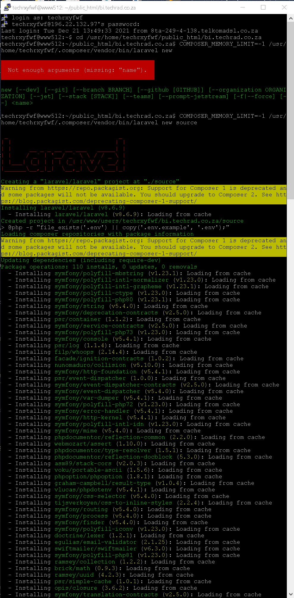
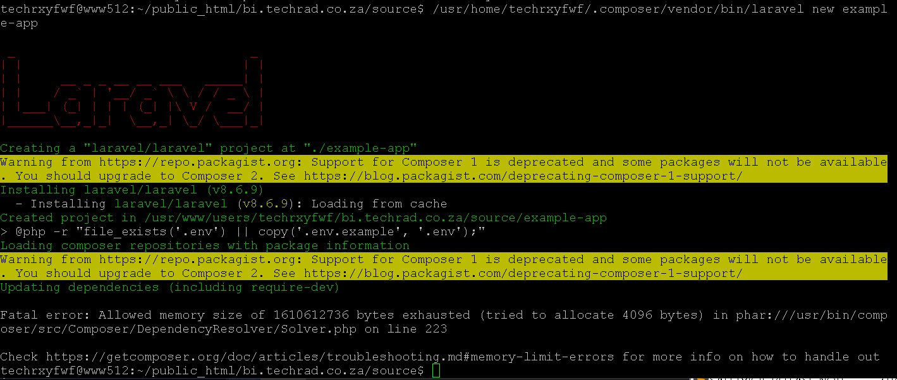
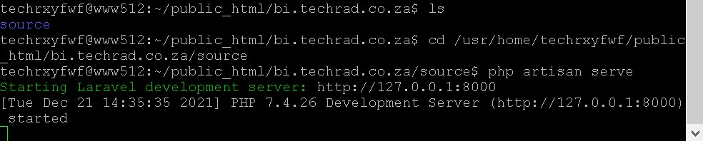

# Laraval setup on Xneelo basic hosting

Enable SSH https://xneelo.co.za/help-centre/products-and-services/enable-ssh

How to SSH with Xneelo https://xneelo.co.za/help-centre/website/ssh-to-your-hosting-server

Install Composer https://xneelo.co.za/help-centre/products-and-services/dedicated-hosting/managing-dedicated-hosting/composer

Laraval installation https://laravel.com/docs/8.x/installation

Laraval deployment https://laravel.com/docs/8.x/deployment

Laraval deployment shared hoasting https://codelapan.com/post/easy-ways-to-upload-or-deploy-laravel-project-to-shared-hosting

### login to TechRads SSH session and run this in the root dir

Update to composer 2 failed with xneeleo permission denied
```
composer self-update --2
```
## STEPS

1. CD to the subdomain dir in your SSH session
```
cd /usr/home/Username/public_html/bi.techrad.co.za
```

2. Install Laraval
```
composer global require laravel/installer
```

[](img/composer_global.jpg)

3. Create your application
```
cd /usr/home/Username/public_html/bi.techrad.co.za
COMPOSER_MEMORY_LIMIT=-1 /usr/home/Username/.composer/vendor/bin/laravel new source
```

[](img/laraval_install.jpg)

I got a memory error like bellow so I had to run with `COMPOSER_MEMORY_LIMIT=-1`

[](img/memory_error.jpg)

4. Start the app

```
cd /usr/home/Username/public_html/bi.techrad.co.za/source
php artisan serve
php artisan serve --host 0.0.0.0 --port 8000
```

TODO
- access pages via internet
- setup configuration file
- look at laraval frontend templates

[](img/run.jpg)

* Usefull commands
    * Delete old dir
    ```
    rm -r bi
    ```

    * Cd into public html dir
    ```
    cd public_html
    ```

    * Read a file
    ```
    cat /etc/php/7.4/cli/php.ini
    ```

    * Copy file to  a location
    ```
    cp /etc/php/7.4/cli/php.ini /usr/home/Username/public_html/bi.techrad.co.za
    ```

    * Check dir
    ```
    ls /usr/home/Username/public_html/bi.techrad.co.za
    ```

    * List process
    ```
    ps aux
    ``` 

    * Kill a process
    ```
    kill 8745
    ``` 


